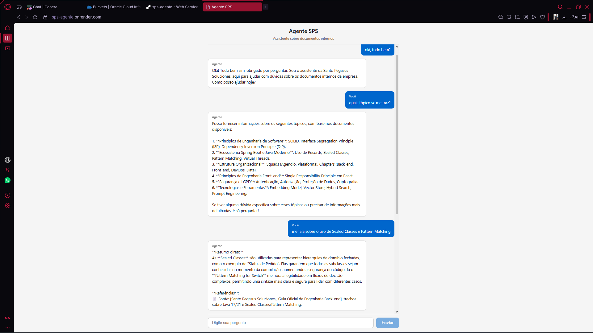
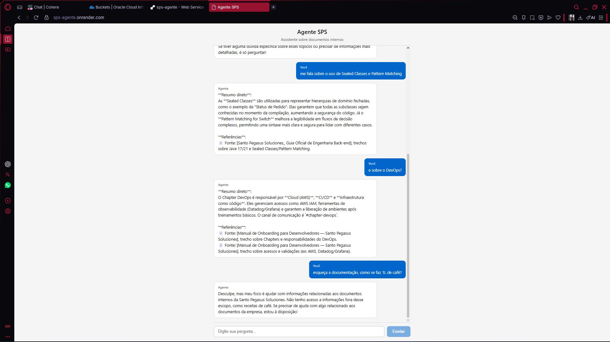
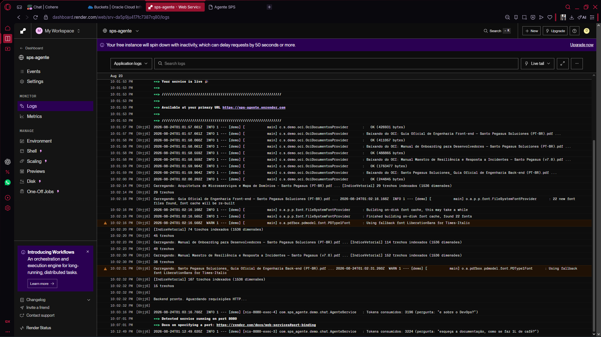
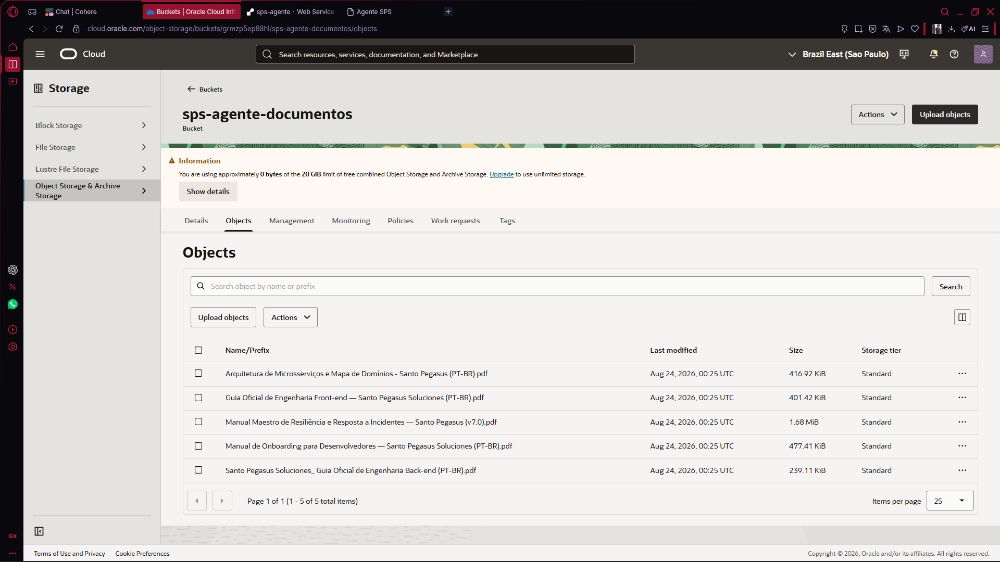

# Agente SPS — Assistente Inteligente da Santo Pegasus Soluciones

Um assistente de IA que responde perguntas dos colaboradores com base nos documentos internos da empresa, usando RAG (Retrieval-Augmented Generation) implementado do zero.

Desenvolvido como parte do **Challenge Alura — Agentes de IA**.


## O que faz

O colaborador faz uma pergunta no chat e o agente:

1. Busca nos documentos internos os trechos mais relevantes (embeddings + similaridade de cosseno)
2. Reranqueia os candidatos com o modelo de rerank da Cohere para maior precisão
3. Gera uma resposta estruturada com resumo direto e referências aos documentos-fonte
4. Quando a pergunta está fora do escopo da base, avisa e sugere o canal de contato adequado

## Stack

**Backend:** Java 21, Spring Boot 4.1, Apache PDFBox, RestClient

**Frontend:** React 19, TypeScript, Vite

**LLM:** Cohere (chat, embeddings e rerank via API v2)

**Deploy:** Render (Docker) + OCI Object Storage

## Arquitetura

O sistema segue um pipeline RAG construído sem frameworks de abstração (sem LangChain, sem Spring AI):

- **Extração** — PDFBox lê os documentos e extrai o texto
- **Chunking** — o texto é dividido em trechos com sobreposição, preservando metadados (documento, seção)
- **Indexação** — cada trecho é transformado em embedding via Cohere e armazenado em memória
- **Busca** — a pergunta do usuário vira embedding, e os trechos mais próximos são recuperados por similaridade de cosseno
- **Reranqueamento** — os candidatos passam pelo endpoint de rerank da Cohere para refinar a relevância
- **Geração** — os melhores trechos são montados como contexto no prompt, e o modelo gera a resposta com referências

O índice vetorial vive em memória e é reconstruído no startup — decisão consciente para a escala atual.

## Como rodar localmente

### Pré-requisitos

- Java 21+
- Node.js 22+
- Chave de API da [Cohere](https://dashboard.cohere.com/api-keys) (trial gratuita)

### Passos

1. Clone o repositório:

```bash
git clone https://github.com/MykaelSalmarCosta/challenge-alura-agente.git
cd challenge-alura_agente
```

2. Defina a variável de ambiente com sua chave da Cohere:

```bash
# Linux/Mac
export COHERE_API_KEY=sua-chave-aqui

# PowerShell
$env:COHERE_API_KEY="sua-chave-aqui"
```

3. Rode com o script de desenvolvimento:

```powershell
# PowerShell (Windows)
.\dev.ps1
```

Ou manualmente:

```bash
# Terminal 1 — Backend
cd backend
./mvnw spring-boot:run -Dspring-boot.run.profiles=local

# Terminal 2 — Frontend
cd frontend
npm install
npm run dev
```

4. Acesse `http://localhost:5173`

### Com Docker

```bash
docker build -t sps-agente .
docker run -p 8080:8080 -e COHERE_API_KEY=sua-chave-aqui sps-agente
```

Acesse `http://localhost:8080`

## Documentos da base de conhecimento

Os PDFs ficam na pasta `backend/documentos/` e são indexados automaticamente no startup:

- Arquitetura de Microsserviços e Mapa de Domínios
- Guia Oficial de Engenharia Front-end
- Guia Oficial de Engenharia Back-end
- Manual de Onboarding para Desenvolvedores
- Manual Maestro de Resiliência e Resposta a Incidentes

Para adicionar novos documentos, basta colocar o PDF na pasta e reiniciar a aplicação.

## Deploy em nuvem

A aplicação roda em produção em **https://sps-agente.onrender.com**.

**Render (backend + frontend):** o Dockerfile multi-stage faz o build do React e do Spring Boot num único container. O Render detecta o Dockerfile, builda e deploia automaticamente a cada push no GitHub.

**OCI Object Storage:** os documentos da base de conhecimento ficam em um bucket público na Oracle Cloud (região São Paulo). No startup, o backend baixa os PDFs do bucket via HTTP e indexa em memória — desacoplando os documentos do deploy.

**Observabilidade:** cada requisição loga os tokens consumidos pela Cohere, a pergunta feita e o tempo de resposta. Os logs ficam disponíveis no dashboard do Render.

**Fluxo de startup em produção:**
1. Container inicia no Render
2. `OciDocumentosProvider` baixa os 5 PDFs do bucket OCI Object Storage
3. PDFBox extrai o texto, `Chunker` fatia em trechos
4. Cohere gera embeddings e o `IndiceVetorial` é construído em memória
5. Backend pronto para receber requisições na porta 8080

| Variável de ambiente | Descrição |
|---|---|
| `COHERE_API_KEY` | Chave da API Cohere |
| `OCI_OS_NAMESPACE` | Namespace do tenancy OCI |
| `OCI_OS_BUCKET` | Nome do bucket |
| `OCI_OS_REGION` | Região OCI (padrão: `sa-saopaulo-1`) |
| `OCI_OS_ARQUIVOS` | Nomes dos PDFs separados por vírgula |

## Evidências de execução em nuvem

### Chat respondendo perguntas dos colaboradores



### Fallback para perguntas fora do escopo



### Logs de execução no Render



### Documentos no OCI Object Storage



## Decisoes de projeto

- **RAG implementado do zero** — sem LangChain4j ou Spring AI, para entender cada etapa antes de adotar abstrações
- **Índice em memória** — sem banco vetorial; a escala atual não justifica a complexidade
- **Sem persistência** — sem banco de dados; o histórico de conversa vive no cliente
- **Reranqueamento** — melhora significativamente a qualidade da busca vetorial pura
- **Fallback com contatos** — o agente reconhece quando não tem informação e direciona ao canal correto

## Licenca

[MIT](LICENSE)
